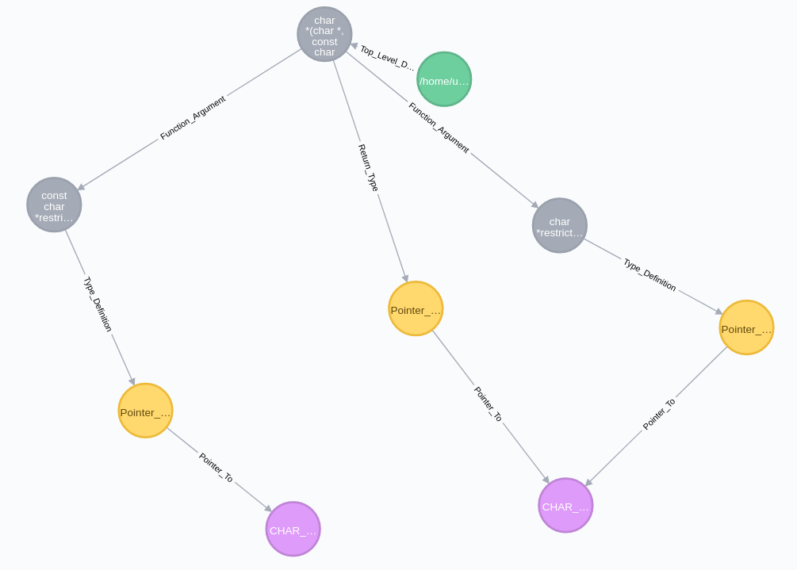

# Neo4j_AST_Generator
A simple script utilizing libclang's python bindings in order to parse the windows header files (Windows.h) and represent them as a Neo4j DB

# Requirements
  - Clang
  - Neo4j DB
  

 # Screenshot

Analysis of the STRCPY function. 
Each node contains information like the name of the parameter, number of arguments, size of each type.

 

